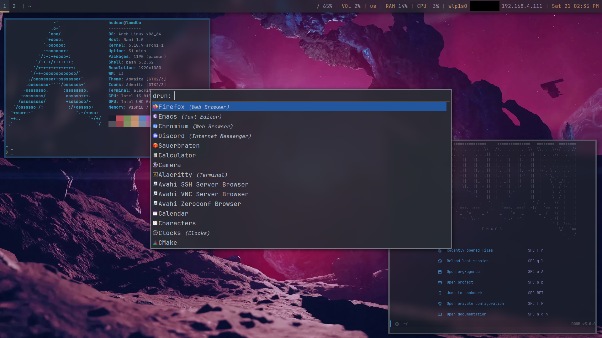

  

  

  
  > "Success is not final, failure is not fatal: It is the courage to continue that counts." — Winston Churchill

  

Hi, I'm Hudson, a Linux enthusiast (I use Arch, as you can probably tell) and a programmer with a passion for building innovative software. I like tackling challenging projects and continuously expanding my knowledge in areas that inspire me.

Many of my projects are for various niche online communities that involve anonymity, so I cannot share the repo contents.
However, I have shared the template I have used in some of these private projects.

As of late 2025, I have privated many repos that were created during middle school.

Right now, I am focusing on practical applications of devops in production environments (hosting sites and servers for friends)
This means that I cannot share many server configurations or dotfiles, as they are closely coupled with the environments which they are/were designed.

For example, the multiple minecraft servers I have hosted contain sensitive player info that I do not wish to expose to the public.
